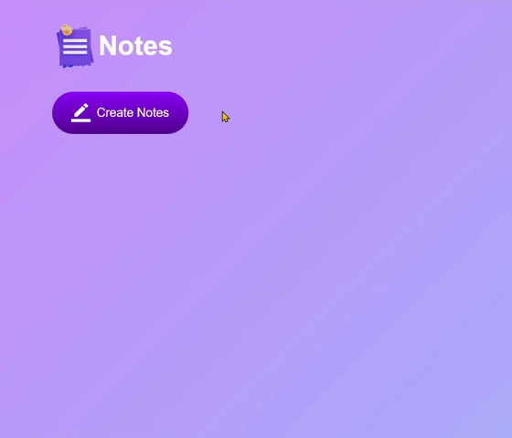

# Notes App 📝

## Overview
"Notes App" is a simple web application that allows users to create, edit, and delete notes. Users can easily manage their notes within the application, and the data is stored locally using the browser's localStorage.

## Technologies Used 🚀
- HTML
- CSS
- JavaScript

## Usage 💻
1. Create a Note:
    - Click the "Create Notes" button to add a new note.
    - The note is created with an editable content area, allowing users to input their notes.
2. Edit a Note:
    - Click on an existing note's content area to edit the text.
    - The changes are automatically saved to localStorage.
3. Delete a Note:
    - Click on the delete icon within a note to remove it from the list.
    - The deleted note is removed from localStorage.
    

## Features ✨
- Create, edit, and delete notes effortlessly.
- Persistent Storage: Notes are stored locally using the browser's localStorage.

## Installation
No special installation is required for this project. Simply download the project files and open the index.html file in a web browser.

## Live Demo 🌐
Live Demo: [Notes App](https://notes-app-orpin-alpha.vercel.app/)

## Contributing 🤝
Feel free to use, modify, and contribute to the project! If you have any questions or feedback, you can reach me at nisagokdemir@gmail.com Enjoy note-taking!

## License
This project is licensed under the MIT License.
